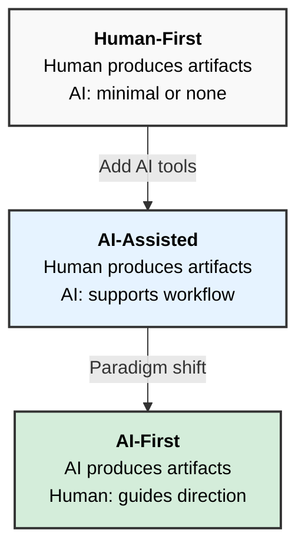

# Una Definición Formal de AI-First

**Versión:** 1.0.0  
**Publicado:** 11 de febrero de 2026

## Estableciendo criterios rigurosos para el paradigma AI-First en desarrollo de software y estrategia organizacional

## Resumen

El término "AI-First" se ha vuelto ubicuo en el discurso del desarrollo de software, pero carece de una definición formal y rigurosa. Las definiciones existentes tienden a ser aspiracionales en lugar de operacionales—describen un estado deseado sin proporcionar criterios para determinar si algo es o no AI-First. Este whitepaper aborda esta brecha estableciendo una definición formal fundamentada en un criterio claro: **quién produce los artefactos de un proceso**. Al examinar AI-First a través del lente de su antónimo (Human-First) y establecer un espectro que incluye AI-Assisted como estado intermedio, este trabajo proporciona una definición práctica para entender y aplicar el paradigma AI-First en desarrollo de software. Aunque la definición aplica ampliamente a otros dominios, el desarrollo de software sirve como contexto principal para este análisis.

## 1. Introducción

Toda empresa tecnológica importante y un número creciente de organizaciones de software y negocios afirman ser "AI-First". El término aparece en anuncios de herramientas de desarrollo, marketing de IDEs y estrategias de equipos de ingeniería. Sin embargo, cuando se les presiona por una definición precisa, la mayoría de las explicaciones se disuelven en aspiraciones vagas sobre "poner la IA en el centro" o "integrar inteligencia en el proceso de desarrollo".

Esta imprecisión semántica crea problemas reales. Los equipos de desarrollo no pueden evaluar si han logrado un flujo de trabajo AI-First. Los proveedores de herramientas no pueden determinar si sus productos califican como AI-First. El término se convierte en lenguaje de marketing en lugar de un concepto útil.

Una definición debe permitir su aplicación. Debe proporcionar criterios que permitan a los profesionales determinar, con confianza razonable, si un proceso, sistema u organización cumple con la definición. Las definiciones existentes fallan esta prueba.

Este whitepaper establece una definición formal de AI-First que es precisa, aplicable a procesos y sistemas de desarrollo reales, y no absolutista—reconociendo un espectro en lugar de un estado binario.

## 2. El Problema con las Definiciones Existentes

Considere estas definiciones representativas de fuentes de la industria:

> "AI First means integrating artificial intelligence into the core of an organization's strategy, products, and operations."
> — Splunk

> "AI-First Development represents a philosophical and practical shift that places artificial intelligence at the center of every development decision."
> — RTInsights

> "AI-first architecture is a software development strategy where AI is at the core of the system's design, instead of being treated as an add-on or secondary feature."
> — 10Pearls

Estas definiciones comparten un patrón consistente: describen AI-First en términos de posición—"en el centro", "en el núcleo"—pero no proporcionan criterios para determinar si algo realmente ocupa esa posición. Contrastan AI-First con ser "un complemento" o "retrofitting", pero nunca establecen dónde cae la línea entre los dos. Invocan alcance con frases como "cada proceso" y "cada decisión", sin especificar qué significa esto en la práctica.

Estas definiciones son aspiracionales en lugar de operacionales. Describen un estado deseado pero no proporcionan mecanismo para determinar si algo es o no AI-First, para medir el grado de adopción, o para tomar decisiones concretas basadas en el concepto. Un equipo de desarrollo que lee estas definiciones no puede evaluar su propio estado. Un proveedor de herramientas no puede determinar si su producto califica. El término se convierte en lenguaje de marketing en lugar de una definición funcional que permite la acción.

## 3. Un Enfoque Metodológico: Entendiendo a Través de Antónimos

Para definir AI-First con precisión, comenzamos con su opuesto semántico: **Human-First**.

Este enfoque no es arbitrario. El sufijo "-First" en el discurso tecnológico tiene precedente. El diseño "Mobile-First" significaba diseñar para dispositivos móviles como objetivo principal, con escritorio como secundario. El antónimo era implícito: "Desktop-First" (o simplemente diseño web tradicional). Entender uno iluminaba al otro.

De manera similar, AI-First se vuelve más claro cuando se contrasta con procesos Human-First—el modo tradicional de operación que ha dominado los negocios y la tecnología durante décadas.

## 4. El Espectro: De Human-First a AI-First

En lugar de una distinción binaria, esta definición reconoce un espectro con tres posiciones:

### 4.1 Human-First

En los procesos Human-First, el humano es el productor central de artefactos. El proceso ha sido refinado y especializado para optimizar la eficiencia humana—proporcionando herramientas, métodos, controles y flujos de trabajo que permiten al humano trabajar efectivamente.

El humano escribe el código, documentos y diseños. El humano toma y documenta decisiones. Las herramientas asisten pero no producen. La optimización del proceso se enfoca en la productividad humana.

Este es el modelo tradicional. Un equipo de desarrollo de software usando IDEs convencionales, control de versiones y herramientas de gestión de proyectos opera en modo Human-First. El desarrollador escribe cada línea de código. El escritor técnico produce cada documento.

### 4.2 AI-Assisted

AI-Assisted representa un estado intermedio donde las herramientas de IA apoyan el flujo de trabajo humano, pero el humano permanece como el productor central de artefactos.

El humano aún produce los artefactos. La IA proporciona sugerencias, completaciones o mejoras. El humano revisa, acepta, modifica o rechaza las contribuciones de la IA. El proceso permanece fundamentalmente centrado en el humano.

Muchas herramientas actuales "potenciadas por IA" operan en este modo. El autocompletado de código sugiere los siguientes tokens. Los asistentes de escritura ofrecen opciones de reformulación. El humano permanece en control de la producción; la IA simplemente acelera ciertas tareas.

En modo AI-Assisted, remover la IA ralentizaría el proceso pero no lo cambiaría fundamentalmente. El humano aún podría producir los artefactos sin soporte de IA.

### 4.3 AI-First

En los procesos AI-First, el paradigma se invierte. La IA se convierte en el productor principal de artefactos, mientras el humano asume el rol de guía—proporcionando dirección, tomando decisiones y asegurando alineación con los objetivos.

La IA produce los artefactos: código, documentos, diseños. El humano proporciona dirección y toma decisiones. El humano revisa y valida la salida de la IA. El proceso está diseñado alrededor de las capacidades de producción de la IA.

En modo AI-First, el humano no podría producir los artefactos a la misma escala o velocidad sin la IA. El proceso depende de la IA como el Production Engine.

## 5. La Definición Formal

Basado en este análisis, la definición formal es:

> **AI-First** (adjetivo): Describe un proceso, sistema u organización en el cual la inteligencia artificial produce confiablemente la mayoría de sus artefactos a lo largo del flujo de trabajo, con humanos sirviendo como guías que proporcionan dirección, toman decisiones y validan las salidas.

### 5.1 Aplicando la Definición: Un Ejemplo

Considere un desarrollador de software que, trabajando con un agente de desarrollo de IA, implementa el código para una aplicación hasta el punto donde ese código es funcional y listo para producción—reduciendo lo que tradicionalmente requeriría semanas de trabajo a cuestión de horas o días. El desarrollador no escribe el código; la intervención es mínima, limitada a casos extremos donde la IA no puede resolver un problema por sí sola. Este escenario califica como AI-First porque la IA produce la mayoría de los artefactos (el código), mientras el desarrollador sirve como guía: definiendo requerimientos, tomando decisiones arquitectónicas y validando la salida. Sin este enfoque impulsado por IA, el desarrollador no podría alcanzar este nivel de productividad. Las limitaciones humanas—acceso a información, amplitud de conocimiento, velocidad de procesamiento—restringirían el trabajo a líneas de tiempo tradicionales. La IA no está simplemente asistiendo; es el Production Engine que hace posible el resultado a esta escala.

### 5.2 Definiendo "Artifacts"

Los Artifacts son las salidas tangibles de un proceso, sistema u organización. En desarrollo de software—el contexto principal de este whitepaper—los artifacts incluyen código fuente, documentación, casos de prueba, especificaciones de diseño, archivos de configuración y scripts de despliegue. La definición se extiende a otros dominios: en procesos de negocio, los artifacts incluyen reportes, análisis, propuestas y diseños.

Las decisiones permanecen como responsabilidad del guía humano. Las decisiones documentadas son artifacts, pero la autoridad de toma de decisiones permanece con el humano.

### 5.3 Definiendo "Guide"

El término "guide" (guía) se elige deliberadamente para transmitir la naturaleza del rol humano en los procesos AI-First.

Considere un viaje a través de una jungla para alcanzar un asentamiento distante. Un guía potencial dice: "No conozco la jungla y no estoy seguro de dónde está el asentamiento, pero si lo intentamos, podríamos lograrlo." Otro conoce la jungla vagamente y tiene un sentido general de dirección. Un tercero conoce la jungla íntimamente, ha estudiado el mapa, lleva una brújula, entiende técnicas de supervivencia, y ha hecho el viaje antes—o como mínimo, posee todo el conocimiento requerido para hacerlo exitosamente por primera vez.

Ninguna persona racional elegiría al primer guía. El segundo es marginalmente mejor. El tercero es la única elección razonable. La diferencia no es meramente experiencia—es la capacidad de conocer el destino, evaluar el progreso hacia él, reconocer cuándo el camino diverge del objetivo, y tomar acción correctiva.

Esta metáfora ilumina un punto crítico en el discurso AI-First. Cuando alguien afirma que "un desarrollador que no sabe nada construyó una aplicación completa usando IA", están describiendo un viaje liderado por un guía que no conoce ni la jungla ni el destino. La IA puede alcanzar algo a través de fuerza bruta y coincidencia afortunada, pero esto es una apuesta, no una metodología. Puede funcionar ocasionalmente; no puede funcionar confiablemente.

El término "guide" por lo tanto lleva implicaciones específicas. Un guía conoce el destino—qué artifact debe producirse. Un guía entiende los estándares de calidad que el artifact debe cumplir. Un guía comprende cómo debe producirse el artifact. Un guía puede evaluar si la salida de la IA contribuye al objetivo o diverge de él. Un guía lleva la responsabilidad del producto final.

La IA, aunque autónoma en ejecución, opera mecánicamente—encontrando relaciones y caminos probables dentro de la información. Esto es distinto del pensamiento creativo y original. La creatividad es intrínseca a los individuos, moldeada por sus experiencias y conocimientos únicos. El guía humano proporciona esta dirección creativa, junto con decisiones estratégicas, validación y responsabilidad.

AI-First no significa sin humanos. El desarrollador no desaparece—el rol se transforma. Lo que diferencia a un buen desarrollador de uno pobre es el pensamiento creativo. Solo el pensamiento creativo verdaderamente resuelve problemas; el mecanismo es fuerza bruta contra una pared.

### 5.4 Definiendo "Reliability"

La definición formal especifica que la IA debe producir artifacts confiablemente. Esta palabra lleva implicaciones específicas que merecen clarificación.

Reliability (confiabilidad) significa que el proceso impulsado por IA produce artifacts que cumplen estándares de calidad con una alta tasa de éxito—idealmente 90% o más. Este umbral está basado en nuestra experiencia en Unlimitech Cloud LLC implementando procesos de desarrollo AI-First, donde consistentemente alcanzamos tasas de éxito en o por encima de este nivel. Esto no significa perfección; significa consistencia. El guía humano revisa y valida, pero no debería necesitar reescribir o rehacer sustancialmente la salida de la IA en la mayoría de los casos.

Un flujo de trabajo de desarrollo que usa IA para generar código pero produce salida inutilizable el 50% del tiempo no cumple este estándar—es un experimento, no un proceso AI-First. Un flujo de trabajo donde la IA consistentemente produce artifacts que requieren solo validación y ajustes menores del guía humano demuestra la confiabilidad requerida para el estatus AI-First.

> **Base empírica:** En Unlimitech Cloud LLC, medimos la confiabilidad a través de múltiples proyectos de desarrollo AI-First comparando artifacts producidos por IA contra estándares de calidad antes de la intervención humana. Nuestros procesos consistentemente alcanzaron tasas de éxito de 90% o más, con algunos proyectos alcanzando 0% de intervención humana en la producción de código fuente.

Usar IA para generar código inicial pero luego requerir que humanos escriban pruebas, documentación y scripts de despliegue no constituye desarrollo AI-First. De manera similar, usar herramientas de IA desconectadas para tareas aisladas—sin integración a través del flujo de trabajo—representa adopción fragmentada dentro de un proceso fundamentalmente Human-First.

## 6. La Mentalidad AI-First

Adoptar AI-First no es meramente un cambio tecnológico—comienza con un cambio en el pensamiento. La mentalidad tradicional, optimizada para patrones de trabajo humano, debe evolucionar hacia una compatible con cómo opera la IA.

La IA sobresale siguiendo patrones y trabajando con entradas semánticamente organizadas. Una instrucción vaga como "escribe algo de código" produce resultados diferentes que un prompt con parámetros claros, restricciones explícitas, contexto definido y un camino preciso hacia el resultado deseado. Un guía que piensa metódicamente, usa terminología consistente y proporciona contexto bien organizado obtendrá artifacts de mayor calidad y más precisos de la IA.

AI-First requiere pensar en términos de lo que la IA hace bien y cómo la IA trabaja mejor, en lugar de descomponer el trabajo en pasos que un humano tomaría. Esta es una reorientación fundamental. Entender cómo funciona la IA ayuda a construir una forma de pensar que es compatible con la IA como el Production Engine.

Considere un ejemplo concreto de arquitectura de software. En desarrollo Human-First, agrupar 15 o 20 endpoints de servicio web en una sola clase controller tenía sentido. Un desarrollador humano puede navegar el archivo fácilmente, aislando mentalmente la sección relevante mientras ignora el resto. Pero para la IA, esta estructura es ineficiente. Cuando la IA debe trabajar en un solo endpoint, debe procesar el archivo completo—20 definiciones de endpoints—para encontrar la sección relevante. Esto desperdicia contexto e introduce ruido.

Un enfoque AI-First podría en cambio usar micro-controllers: un archivo por endpoint. Esto produce 20 archivos en lugar de uno. Para un humano navegando manualmente, esto se siente tedioso. Para la IA, es ideal—cada archivo contiene solo la información relevante, sin ruido que filtrar. La IA puede localizar y trabajar en el archivo preciso necesario sin procesar código irrelevante.

Lo que es incómodo para humanos puede ser cómodo para la IA, y viceversa. El pensamiento AI-First significa diseñar estructuras, entradas y flujos de trabajo alrededor de cómo la IA opera más efectivamente, no alrededor de la conveniencia humana.

Este cambio de mentalidad también requiere entender las limitaciones de la IA. La IA no es buena en todo. La capacidad de manejar problemas no estructurados no significa que cada problema deba lanzarse a la IA sin pensamiento. Cuando un guía envía un problema y recibe una solución sin entender cómo la IA llegó a esa solución, emerge una brecha peligrosa. Esta brecha—entre el problema dado y la solución recibida, sin comprensión del camino entre ellos—representa un riesgo significativo a largo plazo. El guía debe entender lo suficiente para evaluar si la salida de la IA realmente resuelve el problema correctamente.

## 7. Sistemas Legacy y AI-First

Las herramientas de desarrollo y flujos de trabajo existentes diseñados para operación Human-First no pueden simplemente "migrar" a AI-First. El paradigma está incrustado en su arquitectura, interfaces y suposiciones.

Los sistemas legacy deben evolucionar, no migrar. Esta evolución comienza con una evaluación detallada contra la definición establecida en este whitepaper: qué procesos actualmente producen artifacts, quién los produce, y qué cambiaría si la IA asumiera ese rol. Esta evaluación revela la brecha entre el estado actual y la operación AI-First, y mide el impacto del cambio de paradigma en los flujos de trabajo existentes.

La transformación es organizacional y cultural antes de ser tecnológica. Los equipos deben entender y aceptar la redefinición de roles—de productores a guías. Los flujos de trabajo deben ser reconcebidos alrededor de la IA como el Production Engine. Solo después de este cambio organizacional pueden los cambios tecnológicos entregar los beneficios esperados. Implementar herramientas de IA sin la correspondiente transformación cultural resulta en la adopción fragmentada e inconsistente descrita anteriormente: características de IA superpuestas sobre procesos Human-First, produciendo ni la eficiencia de los flujos de trabajo tradicionales ni el apalancamiento de la operación AI-First.

Esta evaluación frecuentemente lleva a un punto de inflexión. Las organizaciones pueden darse cuenta de que sus sistemas legacy son fundamentalmente incompatibles con la operación AI-First—que el paradigma está tan profundamente incrustado en la arquitectura que la evolución se vuelve prohibitivamente costosa. El costo en tiempo, recursos y disrupción organizacional puede exceder lo que muchas empresas pueden sostener, haciendo la evolución directa no competitiva o simplemente inviable.

Esta realización hace surgir una consideración que habría parecido absurda en la era Human-First: reconstruir desde cero. Históricamente, reescribir un sistema maduro era una empresa titánica—años de trabajo, enorme riesgo y resultados inciertos. Pero el desarrollo AI-First cambia este cálculo. En nuestra propia práctica en Unlimitech Cloud LLC, transformar procesos de desarrollo a AI-First ha producido factores de eficiencia que exceden el 1000%. Lo que antes requería meses ahora puede lograrse en días. La reconstrucción de un sistema, diseñado desde cero con procesos de desarrollo AI-First, se vuelve no solo viable sino potencialmente el camino más racional.

> **Base empírica:** Las comparaciones de eficiencia en Unlimitech Cloud LLC midieron el tiempo de entrega para tareas de desarrollo comparables bajo procesos Human-First y AI-First. Proyectos que previamente requerían meses de esfuerzo de desarrollo fueron completados en días usando flujos de trabajo AI-First, representando mejoras de eficiencia que exceden el 1000%.

La elección entre evolucionar un sistema legacy y reconstruir con procesos de desarrollo AI-First se convertirá en una de las decisiones estratégicas definitorias para las organizaciones en los próximos años—ya sea que produzcan software como su negocio principal o dependan del software para habilitar sus operaciones.

Este whitepaper no aborda la metodología para tal evolución o reconstrucción. El punto aquí es más simple: los equipos de desarrollo y proveedores de herramientas no deberían reclamar estatus AI-First si sus flujos de trabajo permanecen fundamentalmente centrados en humanos con características de IA añadidas encima.

## 8. Conclusión

El momento actual está caracterizado por el hype de marketing. Toda empresa reclama capacidades de IA, y el mercado aún no ha desarrollado la sofisticación para distinguir sustancia de retórica. Pero esta fase es temporal.

A medida que los procesos AI-First maduren y sus resultados se vuelvan visibles, la brecha entre organizaciones que se transformaron genuinamente y aquellas que meramente adoptaron el lenguaje se ampliará hasta volverse inconfundible—primero para competidores, luego para clientes. Los usuarios finales reconocerán el valor AI-First cuando lo experimenten. Las empresas cuyas afirmaciones de IA fueron puramente posicionamiento estratégico enfrentarán un ajuste de cuentas de credibilidad.

Algunos individuos y organizaciones aún se resisten a esta transformación, viendo la IA como una amenaza o una tendencia pasajera. Esta resistencia es comprensible pero ultimadamente fútil. El cambio es una inevitabilidad económica. Las organizaciones que lo abracen reflexivamente—no por miedo a la irrelevancia sino por comprensión del paradigma—alcanzarán ventajas competitivas medidas en órdenes de magnitud. Aquellas que adopten IA superficialmente para mantener relevancia de marketing durante el ciclo de hype se encontrarán incapaces de competir cuando solo quede la capacidad genuina.

Esta transformación no elimina a los desarrolladores o roles técnicos—los redefine. El modelo tradicional de desarrollo de software ya no es económicamente viable o competitivo en tiempo de entrega cuando se compara con flujos de trabajo AI-First. La necesidad de experiencia humana no desaparece; se desplaza. Las habilidades que importan cambian—de ejecución mecánica a resolución creativa de problemas, pensamiento sistémico y la capacidad de dirigir la IA efectivamente. Los roles técnicos deben evolucionar para coincidir con lo que los procesos AI-First realmente requieren.

Una definición formal permite acción informada. Lo que las organizaciones hagan con esa base determinará su lugar en lo que viene después.

---

## Referencias

### Definiciones Existentes Revisadas

1. **Pichai, Sundar (Google).** "In the long run, we're evolving in computing from a 'mobile-first' to an 'AI-first' world." Alphabet Q1 2016 Earnings Call.
   <https://www.businessinsider.com/sundar-pichai-ai-first-world-2016-4>

2. **Gartner (2025).** "It requires considering AI as a primary option for every decision and investment — and choosing to use the technology where it delivers the greatest value." / "An AI-first strategy makes artificial intelligence a default consideration when addressing business challenges."
   <https://www.gartner.com/en/articles/ai-first>

3. **Splunk (2025).** "AI First means integrating artificial intelligence into the core of an organization's strategy, products, and operations." / "An AI first mindset is not about automating manual processes — it is about embedding data-driven intelligence and automation into tasks that traditionally require human supervision."
   <https://www.splunk.com/en_us/blog/learn/ai-first.html>

4. **RTInsights (2025).** "AI-First Development represents a philosophical and practical shift that places artificial intelligence at the center of every development decision."
   <https://www.rtinsights.com/ai-first-development-the-strategic-imperative-for-modern-enterprises/>

5. **10Pearls (2025).** "AI-first architecture (AFA) is a software development strategy where AI is at the core of the system's design, instead of being treated as an add-on or secondary feature."
   <https://10pearls.com/ai-first-architecture-in-enterprise-tech/>

---

## Apéndice A: Glosario

**AI-First** — Un paradigma en el cual la inteligencia artificial produce confiablemente la mayoría de los artifacts a lo largo del flujo de trabajo, con humanos sirviendo como guías.

**AI-Assisted** — Un modo de operación donde los humanos permanecen como los productores principales de artifacts, con la IA proporcionando soporte y aceleración al flujo de trabajo.

**Artifact** — Una salida tangible de un proceso, sistema u organización, como código, documentos, diseños o decisiones documentadas.

**Controller** — En arquitectura de aplicaciones web, un componente de software que maneja solicitudes entrantes y coordina la respuesta. Los controllers tradicionales frecuentemente agrupan múltiples operaciones relacionadas (endpoints) en un solo archivo.

**Endpoint** — Una ruta URL específica en un servicio web que acepta solicitudes y retorna respuestas. Cada endpoint típicamente realiza una operación discreta (ej., crear un usuario, recuperar una lista).

**Guide** — El rol humano en procesos AI-First: proporcionar dirección creativa, tomar decisiones y validar salidas.

**Human-First** — El paradigma tradicional en el cual los humanos son los productores centrales de artifacts, con procesos optimizados para la productividad humana.

**Micro-controller** — Un patrón arquitectónico donde cada endpoint se implementa en su propio archivo separado, en lugar de agrupar múltiples endpoints en un solo controller. Esta estructura reduce el ruido y mejora la eficiencia de la IA cuando trabaja con código.

**Paradigm** — Un modelo o marco fundamental que moldea cómo el trabajo es concebido, organizado y ejecutado. En este whitepaper, paradigma se refiere a las suposiciones subyacentes sobre quién produce artifacts—humanos o IA—y cómo los procesos están diseñados alrededor de ese productor.

**Production Engine** — El agente principal responsable de generar artifacts en un flujo de trabajo. En procesos Human-First, el humano es el Production Engine. En procesos AI-First, la IA asume este rol, con el humano sirviendo como guía.

**Reliability** — En el contexto de AI-First, la consistencia con la cual la IA produce artifacts que cumplen estándares de calidad. Un proceso AI-First confiable alcanza altas tasas de éxito (90% o más), requiriendo solo validación y ajustes menores del guía humano en lugar de retrabajo sustancial.

---

## Licencia y Atribución

© 2026 Manuel Antonio Lara Pupo. Todos los derechos reservados.
Publicado por Unlimitech Cloud LLC.

Este trabajo está licenciado bajo la **Licencia Creative Commons Atribución-CompartirIgual 4.0 Internacional (CC BY-SA 4.0)**.

Eres libre de compartir y adaptar este material para cualquier propósito, incluyendo uso comercial, siempre que:
- Se dé crédito apropiado al autor original
- Las adaptaciones se distribuyan bajo la misma licencia

Licencia completa: https://creativecommons.org/licenses/by-sa/4.0/deed.es

---

## Sobre el Autor

**Manuel Antonio Lara Pupo** es un Arquitecto de Soluciones Impulsadas por IA con más de 20 años de experiencia construyendo software a escala y más de 11 años diseñando arquitectura empresarial. Se especializa en traducir objetivos de negocio complejos en soluciones robustas y seguras—incluyendo plataformas a escala nacional. Su trabajo reciente se enfoca en habilitación de IA de grado de producción: flujos de trabajo agénticos, implementaciones MCP y pipelines de datos inteligentes. Manuel es el fundador de Unlimitech Cloud LLC, donde combina profunda experiencia técnica con un compromiso de compartir conocimiento que fortalece la comunidad de ingeniería más amplia.

---

## Nota de Transparencia

Este whitepaper fue desarrollado con asistencia de IA para redacción, organización y refinamiento. Todas las ideas, definiciones y posiciones se originaron del autor. La IA sirvió en capacidad AI-Assisted—apoyando al autor humano quien permaneció como guía y tomador de decisiones a lo largo del proceso.

---

**Fuente Original:** [A Formal Definition of AI-First-v1.0.0-ES-signed.pdf](https://github.com/unlimitechcloud/docs.whitepapers/blob/master/A%20Formal%20Definition%20of%20AI-First/releases/A%20Formal%20Definition%20of%20AI-First-v1.0.0-ES-signed.pdf)
