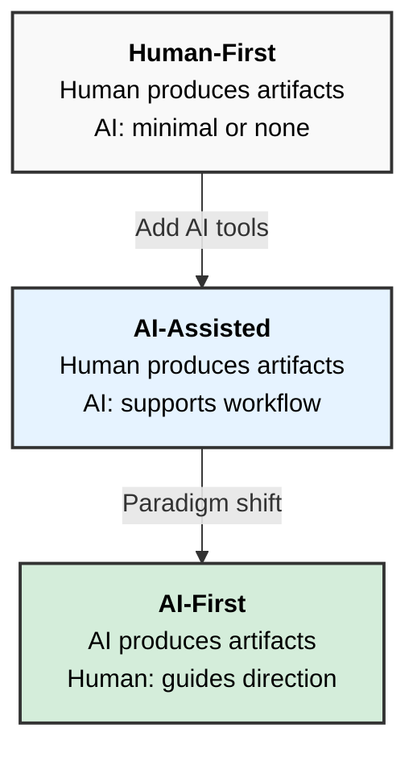

# A Formal Definition of AI-First

**Version:** 1.0.0  
**Published:** February 11, 2026

## Establishing rigorous criteria for the AI-First paradigm in software development and organizational strategy

## Abstract

The term "AI-First" has become ubiquitous in software development discourse, yet lacks a formal, rigorous definition. Existing definitions tend to be aspirational rather than operational—they describe a desired state without providing criteria for determining whether something is or is not AI-First. This whitepaper addresses this gap by establishing a formal definition grounded in a clear criterion: **who produces the artifacts of a process**. By examining AI-First through the lens of its antonym (Human-First) and establishing a spectrum that includes AI-Assisted as an intermediate state, this work provides a practical definition for understanding and applying the AI-First paradigm in software development. While the definition applies broadly to other domains, software development serves as the primary context for this analysis.

## 1. Introduction

Every major technology company and an increasing number of software organizations and businesses claim to be "AI-First." The term appears in developer tool announcements, IDE marketing, and engineering team strategies. Yet when pressed for a precise definition, most explanations dissolve into vague aspirations about "putting AI at the center" or "embedding intelligence into the development process."

This semantic imprecision creates real problems. Development teams cannot evaluate whether they have achieved an AI-First workflow. Tool vendors cannot determine if their products qualify as AI-First. The term becomes marketing language rather than a useful concept.

A definition should enable application. It should provide criteria that allow practitioners to determine, with reasonable confidence, whether a process, system, or organization meets the definition. The existing definitions fail this test.

This whitepaper establishes a formal definition of AI-First that is precise, applicable to real development processes and systems, and non-absolutist—acknowledging a spectrum rather than a binary state.

## 2. The Problem with Existing Definitions

Consider these representative definitions from industry sources:

> "AI First means integrating artificial intelligence into the core of an organization's strategy, products, and operations."
> — Splunk

> "AI-First Development represents a philosophical and practical shift that places artificial intelligence at the center of every development decision."
> — RTInsights

> "AI-first architecture is a software development strategy where AI is at the core of the system's design, instead of being treated as an add-on or secondary feature."
> — 10Pearls

These definitions share a consistent pattern: they describe AI-First in terms of position—"at the center," "at the core"—but provide no criteria for determining whether something actually occupies that position. They contrast AI-First with being "an add-on" or "retrofitting," but never establish where the line falls between the two. They invoke scope with phrases like "every process" and "every decision," without specifying what this means in practice.

These definitions are aspirational rather than operational. They describe a desired state but provide no mechanism for determining whether something is or is not AI-First, for measuring the degree of adoption, or for making concrete decisions based on the concept. A development team reading these definitions cannot evaluate its own status. A tool vendor cannot determine if their product qualifies. The term becomes marketing language rather than a functional definition that enables action.

## 3. A Methodological Approach: Understanding Through Antonyms

To define AI-First with precision, we begin with its semantic opposite: **Human-First**.

This approach is not arbitrary. The "-First" suffix in technology discourse has precedent. "Mobile-First" design meant designing for mobile devices as the primary target, with desktop as secondary. The antonym was implicit: "Desktop-First" (or simply traditional web design). Understanding one illuminated the other.

Similarly, AI-First becomes clearer when contrasted with Human-First processes—the traditional mode of operation that has dominated business and technology for decades.

## 4. The Spectrum: From Human-First to AI-First

Rather than a binary distinction, this definition recognizes a spectrum with three positions:

### 4.1 Human-First

In Human-First processes, the human is the central producer of artifacts. The process has been refined and specialized to optimize human efficiency—providing tools, methods, controls, and workflows that enable the human to work effectively.

The human writes the code, documents, and designs. The human makes and documents decisions. Tools assist but do not produce. Process optimization focuses on human productivity.

This is the traditional model. A software development team using conventional IDEs, version control, and project management tools operates in Human-First mode. The developer writes every line of code. The technical writer produces every document.

### 4.2 AI-Assisted

AI-Assisted represents an intermediate state where AI tools support the human workflow, but the human remains the central producer of artifacts.

The human still produces the artifacts. AI provides suggestions, completions, or enhancements. The human reviews, accepts, modifies, or rejects AI contributions. The process remains fundamentally human-centered.

Many current "AI-powered" tools operate in this mode. Code completion suggests the next few tokens. Writing assistants offer rephrasing options. The human remains in control of production; AI merely accelerates certain tasks.

In AI-Assisted mode, removing the AI would slow the process but not fundamentally change it. The human could still produce the artifacts without AI support.

### 4.3 AI-First

In AI-First processes, the paradigm inverts. The AI becomes the primary producer of artifacts, while the human assumes the role of guide—providing direction, making decisions, and ensuring alignment with goals.

AI produces the artifacts: code, documents, designs. The human provides direction and makes decisions. The human reviews and validates AI output. The process is designed around AI production capabilities.

In AI-First mode, the human could not produce the artifacts at the same scale or speed without the AI. The process depends on AI as the Production Engine.

## 5. The Formal Definition

Based on this analysis, the formal definition is:

> **AI-First** (adjective): Describes a process, system, or organization in which artificial intelligence reliably produces the majority of its artifacts throughout the workflow, with humans serving as guides who provide direction, make decisions, and validate outputs.

### 5.1 Applying the Definition: An Example

Consider a software developer who, working with an AI development agent, implements the code for an application to the point where that code is functional and production-ready—reducing what would traditionally require weeks of work to a matter of hours or days. The developer does not write the code; intervention is minimal, limited to edge cases where the AI cannot resolve a problem on its own. This scenario qualifies as AI-First because the AI produces the majority of the artifacts (the code), while the developer serves as guide: defining requirements, making architectural decisions, and validating the output. Without this AI-driven approach, the developer could not achieve this level of productivity. Human limitations—access to information, breadth of knowledge, processing speed—would constrain the work to traditional timelines. The AI is not merely assisting; it is the Production Engine that makes the outcome possible at this scale.

### 5.2 Defining "Artifacts"

Artifacts are the tangible outputs of a process, system, or organization. In software development—the primary context of this whitepaper—artifacts include source code, documentation, test cases, design specifications, configuration files, and deployment scripts. The definition extends to other domains: in business processes, artifacts include reports, analyses, proposals, and designs.

Decisions remain the responsibility of the human guide. Documented decisions are artifacts, but the decision-making authority stays with the human.

### 5.3 Defining "Guide"

The term "guide" is chosen deliberately to convey the nature of the human role in AI-First processes.

Consider a journey through a jungle to reach a distant settlement. One potential guide says: "I don't know the jungle and I'm not sure where the settlement is, but if we try, we might make it." Another knows the jungle vaguely and has a general sense of direction. A third knows the jungle intimately, has studied the map, carries a compass, understands survival techniques, and has made the journey before—or at minimum, possesses all the knowledge required to make it successfully for the first time.

No rational person would choose the first guide. The second is marginally better. The third is the only reasonable choice. The difference is not merely experience—it is the capacity to know the destination, evaluate progress toward it, recognize when the path diverges from the goal, and take corrective action.

This metaphor illuminates a critical point in the AI-First discourse. When someone claims that "a developer who knows nothing built a complete application using AI," they are describing a journey led by a guide who knows neither the jungle nor the destination. The AI may reach something through brute force and fortunate coincidence, but this is a gamble, not a methodology. It may work occasionally; it cannot work reliably.

The term "guide" therefore carries specific implications. A guide knows the destination—what artifact must be produced. A guide understands the quality standards the artifact must meet. A guide comprehends how the artifact should be produced. A guide can evaluate whether the AI's output contributes to the goal or diverges from it. A guide bears responsibility for the final product.

The AI, while autonomous in execution, operates mechanically—finding relationships and probable paths within information. This is distinct from creative, original thought. Creativity is intrinsic to individuals, shaped by their unique experiences and knowledge. The human guide provides this creative direction, along with strategic decisions, validation, and accountability.

AI-First does not mean human-less. The developer does not disappear—the role transforms. What differentiates a good developer from a poor one is creative thinking. Only creative thought truly solves problems; mechanism is brute force against a wall.

### 5.4 Defining "Reliability"

The formal definition specifies that AI must reliably produce artifacts. This word carries specific implications that merit clarification.

Reliability means the AI-driven process produces artifacts that meet quality standards with a high success rate—ideally 90% or higher. This threshold is based on our experience at Unlimitech Cloud LLC implementing AI-First development processes, where we consistently achieve success rates at or above this level. This does not mean perfection; it means consistency. The human guide reviews and validates, but should not need to substantially rewrite or redo the AI's output in most cases.

A development workflow that uses AI to generate code but produces unusable output 50% of the time does not meet this standard—it is an experiment, not an AI-First process. A workflow where the AI consistently produces artifacts that require only validation and minor adjustments from the human guide demonstrates the reliability required for AI-First status.

> **Empirical basis:** At Unlimitech Cloud LLC, we measured reliability across multiple AI-First development projects by comparing AI-produced artifacts against quality standards before human intervention. Our processes consistently achieved success rates of 90% or higher, with some projects reaching 0% human intervention in source code production.

Using AI to generate initial code but then requiring humans to write tests, documentation, and deployment scripts does not constitute AI-First development. Similarly, using disconnected AI tools for isolated tasks—without integration across the workflow—represents fragmented adoption within a fundamentally Human-First process.

## 6. The AI-First Mindset

Adopting AI-First is not merely a technological change—it begins with a shift in thinking. The traditional mindset, optimized for human work patterns, must evolve into one compatible with how AI operates.

AI excels at following patterns and working with semantically organized inputs. A vague instruction like "write some code" produces different results than a prompt with clear parameters, explicit constraints, defined context, and a precise path toward the desired outcome. A guide who thinks methodically, uses consistent terminology, and provides well-organized context will obtain higher quality, more precise artifacts from the AI.

AI-First requires thinking in terms of what AI does well and how AI works best, rather than decomposing work into steps a human would take. This is a fundamental reorientation. Understanding how AI functions helps build a way of thinking that is compatible with AI as the Production Engine.

Consider a concrete example from software architecture. In Human-First development, grouping 15 or 20 web service endpoints into a single controller class made sense. A human developer can navigate the file easily, mentally isolating the relevant section while ignoring the rest. But for AI, this structure is inefficient. When the AI must work on a single endpoint, it must process the entire file—20 endpoint definitions—to find the relevant section. This wastes context and introduces noise.

An AI-First approach might instead use micro-controllers: one file per endpoint. This produces 20 files instead of one. For a human navigating manually, this feels tedious. For AI, it is ideal—each file contains only the relevant information, with no noise to filter. The AI can locate and work on the precise file needed without processing irrelevant code.

What is uncomfortable for humans may be comfortable for AI, and vice versa. AI-First thinking means designing structures, inputs, and workflows around how AI operates most effectively, not around human convenience.

This mindset shift also requires understanding AI's limitations. AI is not good at everything. The ability to handle unstructured problems does not mean every problem should be thrown at AI without thought. When a guide submits a problem and receives a solution without understanding how the AI arrived at that solution, a dangerous gap emerges. This gap—between the problem given and the solution received, with no comprehension of the path between them—represents a significant long-term risk. The guide must understand enough to evaluate whether the AI's output actually solves the problem correctly.

## 7. Legacy Systems and AI-First

Existing development tools and workflows designed for Human-First operation cannot simply "migrate" to AI-First. The paradigm is embedded in their architecture, interfaces, and assumptions.

Legacy systems must evolve, not migrate. This evolution begins with a detailed assessment against the definition established in this whitepaper: which processes currently produce artifacts, who produces them, and what would change if AI assumed that role. This assessment reveals the gap between current state and AI-First operation, and measures the impact of the paradigm shift on existing workflows.

The transformation is organizational and cultural before it is technological. Teams must understand and accept the redefinition of roles—from producers to guides. Workflows must be reconceived around AI as the Production Engine. Only after this organizational shift can technological changes deliver the expected benefits. Implementing AI tools without the corresponding cultural transformation results in the fragmented, inconsistent adoption described earlier: AI features layered onto Human-First processes, producing neither the efficiency of traditional workflows nor the leverage of AI-First operation.

This assessment frequently leads to an inflection point. Organizations may realize that their legacy systems are fundamentally incompatible with AI-First operation—that the paradigm is so deeply embedded in the architecture that evolution becomes prohibitively expensive. The cost in time, resources, and organizational disruption may exceed what many companies can sustain, rendering direct evolution uncompetitive or simply unviable.

This realization surfaces a consideration that would have seemed absurd in the Human-First era: rebuilding from scratch. Historically, rewriting a mature system was a Titanic undertaking—years of work, enormous risk, and uncertain outcomes. But AI-First development changes this calculus. In our own practice at Unlimitech Cloud LLC, transforming development processes to AI-First has yielded efficiency factors exceeding 1000%. What once required months can now be accomplished in days. The reconstruction of a system, designed from the ground up with AI-First development processes, becomes not just viable but potentially the more rational path.

> **Empirical basis:** Efficiency comparisons at Unlimitech Cloud LLC measured time-to-delivery for comparable development tasks under Human-First and AI-First processes. Projects that previously required months of development effort were completed in days using AI-First workflows, representing efficiency improvements exceeding 1000%.

The choice between evolving a legacy system and rebuilding with AI-First development processes will become one of the defining strategic decisions for organizations in the coming years—whether they produce software as their core business or rely on software to enable their operations.

This whitepaper does not address the methodology for such evolution or reconstruction. The point here is simpler: development teams and tool vendors should not claim AI-First status if their workflows remain fundamentally human-centered with AI features added on top.

## 8. Conclusion

The current moment is characterized by marketing hype. Every company claims AI capabilities, and the market has not yet developed the sophistication to distinguish substance from rhetoric. But this phase is temporary.

As AI-First processes mature and their outputs become visible, the gap between organizations that transformed genuinely and those that merely adopted the language will widen until it becomes unmistakable—first to competitors, then to customers. End users will recognize AI-First value when they experience it. Companies whose AI claims were purely strategic positioning will face a credibility reckoning.

Some individuals and organizations still resist this transformation, viewing AI as a threat or a passing trend. This resistance is understandable but ultimately futile. The shift is an economic inevitability. Organizations that embrace it thoughtfully—not from fear of irrelevance but from understanding of the paradigm—will achieve competitive advantages measured in orders of magnitude. Those that adopt AI superficially to maintain marketing relevance during the hype cycle will find themselves unable to compete when only genuine capability remains.

This transformation does not eliminate developers or technical roles—it redefines them. The traditional model of software development is no longer economically viable or competitive in time-to-delivery when compared to AI-First workflows. The need for human expertise does not disappear; it shifts. The skills that matter change—from mechanical execution to creative problem-solving, system thinking, and the ability to direct AI effectively. Technical roles must evolve to match what AI-First processes actually require.

A formal definition enables informed action. What organizations do with that foundation will determine their place in what comes next.

---

## References

### Existing Definitions Reviewed

1. **Pichai, Sundar (Google).** "In the long run, we're evolving in computing from a 'mobile-first' to an 'AI-first' world." Alphabet Q1 2016 Earnings Call.
   <https://www.businessinsider.com/sundar-pichai-ai-first-world-2016-4>

2. **Gartner (2025).** "It requires considering AI as a primary option for every decision and investment — and choosing to use the technology where it delivers the greatest value." / "An AI-first strategy makes artificial intelligence a default consideration when addressing business challenges."
   <https://www.gartner.com/en/articles/ai-first>

3. **Splunk (2025).** "AI First means integrating artificial intelligence into the core of an organization's strategy, products, and operations." / "An AI first mindset is not about automating manual processes — it is about embedding data-driven intelligence and automation into tasks that traditionally require human supervision."
   <https://www.splunk.com/en_us/blog/learn/ai-first.html>

4. **RTInsights (2025).** "AI-First Development represents a philosophical and practical shift that places artificial intelligence at the center of every development decision."
   <https://www.rtinsights.com/ai-first-development-the-strategic-imperative-for-modern-enterprises/>

5. **10Pearls (2025).** "AI-first architecture (AFA) is a software development strategy where AI is at the core of the system's design, instead of being treated as an add-on or secondary feature."
   <https://10pearls.com/ai-first-architecture-in-enterprise-tech/>

---

## Appendix A: Glossary

**AI-First** — A paradigm in which artificial intelligence reliably produces the majority of artifacts throughout the workflow, with humans serving as guides.

**AI-Assisted** — A mode of operation where humans remain the primary producers of artifacts, with AI providing support and acceleration to the workflow.

**Artifact** — A tangible output of a process, system, or organization, such as code, documents, designs, or documented decisions.

**Controller** — In web application architecture, a software component that handles incoming requests and coordinates the response. Traditional controllers often group multiple related operations (endpoints) in a single file.

**Endpoint** — A specific URL path in a web service that accepts requests and returns responses. Each endpoint typically performs one discrete operation (e.g., creating a user, retrieving a list).

**Guide** — The human role in AI-First processes: providing creative direction, making decisions, and validating outputs.

**Human-First** — The traditional paradigm in which humans are the central producers of artifacts, with processes optimized for human productivity.

**Micro-controller** — An architectural pattern where each endpoint is implemented in its own separate file, rather than grouping multiple endpoints in a single controller. This structure reduces noise and improves AI efficiency when working with code.

**Paradigm** — A fundamental model or framework that shapes how work is conceived, organized, and executed. In this whitepaper, paradigm refers to the underlying assumptions about who produces artifacts—humans or AI—and how processes are designed around that producer.

**Production Engine** — The primary agent responsible for generating artifacts in a workflow. In Human-First processes, the human is the Production Engine. In AI-First processes, the AI assumes this role, with the human serving as guide.

**Reliability** — In the context of AI-First, the consistency with which AI produces artifacts that meet quality standards. A reliable AI-First process achieves high success rates (90% or higher), requiring only validation and minor adjustments from the human guide rather than substantial rework.

---

## License and Attribution

© 2026 Manuel Antonio Lara Pupo. All rights reserved.
Published by Unlimitech Cloud LLC.

This work is licensed under the **Creative Commons Attribution-ShareAlike 4.0 International License (CC BY-SA 4.0)**.

You are free to share and adapt this material for any purpose, including commercial use, provided:
- Appropriate credit is given to the original author
- Adaptations are distributed under the same license

Full license: https://creativecommons.org/licenses/by-sa/4.0/

---

## About the Author

**Manuel Antonio Lara Pupo** is an AI-Driven Solutions Architect with over 20 years of experience building software at scale and 11+ years designing enterprise architecture. He specializes in translating complex business goals into robust, secure solutions—including country-scale platforms. His recent work focuses on production-grade AI enablement: agentic workflows, MCP implementations, and intelligent data pipelines. Manuel is the founder of Unlimitech Cloud LLC, where he combines deep technical expertise with a commitment to sharing knowledge that strengthens the broader engineering community.

---

## Transparency Note

This whitepaper was developed with AI assistance for drafting, organization, and refinement. All ideas, definitions, and positions originated from the author. The AI served in an AI-Assisted capacity—supporting the human author who remained the guide and decision-maker throughout the process.

---

**Original Source:** [A Formal Definition of AI-First-v1.0.0-signed.pdf](https://github.com/unlimitechcloud/docs.whitepapers/blob/master/A%20Formal%20Definition%20of%20AI-First/releases/A%20Formal%20Definition%20of%20AI-First-v1.0.0-signed.pdf)
